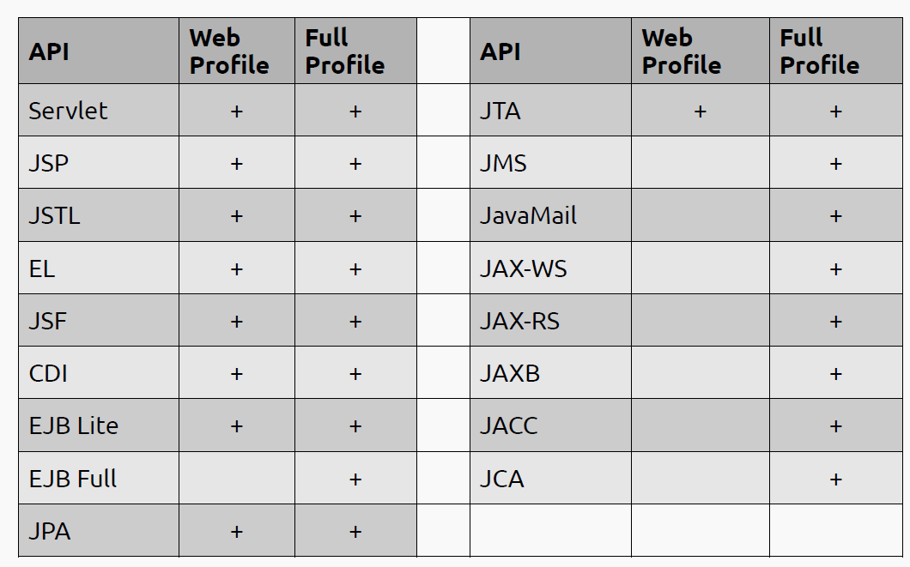
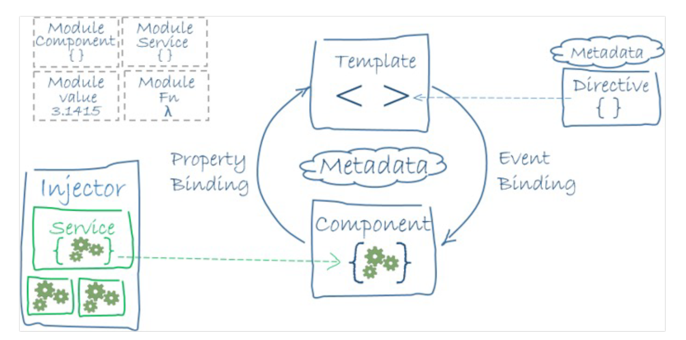

# Часть бэкенда
## 1. Платформа Java EE. Спецификации и их реализации.
Java EE (Enterprise Edition) представляет собой расширенный набор спецификаций и библиотек для разработки масштабируемых, многоуровневых, надежных и безопасных сетевых приложений.

1. **Servlet API (Java Servlets):**
    - **Спецификация:** API для веб-сервлетов, обрабатывающих запросы и отвечающих на них в веб-приложениях.
   
2. **JavaServer Pages (JSP):**
    - **Спецификация:** Технология для создания динамических веб-страниц на стороне сервера.
    
3. **JavaServer Faces (JSF):**
    - **Спецификация:** Фреймворк для построения пользовательских интерфейсов для веб-приложений.
   
4. **Enterprise JavaBeans (EJB):**
    - **Спецификация:** Компонентная модель для модульной и распределенной разработки предприятий.

5. **Java Persistence API (JPA):**
    - **Спецификация:** API для объектно-реляционного отображения (ORM) и управления персистентными данными.
    - **Реализации:** Hibernate, EclipseLink, OpenJPA.

6. **Java Message Service (JMS):**
    - **Спецификация:** API для отправки и получения сообщений между двумя или более клиентами.

7. **Java Transaction API (JTA):**
    - **Спецификация:** API для управления транзакциями в Java.

8. **JavaMail:**
    - **Спецификация:** API для отправки и получения электронной почты.
    - **Реализации:** JavaMail API.

9. **Java API for RESTful Web Services (JAX-RS):**
    - **Спецификация:** API для создания RESTful веб-сервисов.

10. **Java API for XML Web Services (JAX-WS):**
    - **Спецификация:** API для создания SOAP веб-сервисов.

## 2. Принципы IoC, CDI и Location Transparency. Компоненты и контейнеры.

### IoC (Inversion of Control)
- Жизненным циклом компонента управляет контейнер, а не программист
- За взаимодействие между компонентами отвечает
  тоже контейнер.

### CDI (Context & Dependency Injection)

Шаблон проектирования, используемый для достижения IoC. 

Суть: зависимости объекта передаются ему извне, а не создаются самим объектом

Допустим, если есть класс `OrderService`, зависящий от `PaymentService`, то экземпляр `PaymentService` будет передан через конструктор, сеттер или поле.  

### Location Transparency

Принцип, позволяющий вызывать методы удаленных объектов без привязки к их физическому расположению — за их вызов отвечает контейнер

### Контейнеры и компоненты

**Контейнеры в Java EE**

Контейнеры в Java EE - это среда выполнения, которая предоставляет специфические сервисы (например, управление транзакциями, безопасность, жизненный цикл объектов) для различных видов компонентов. 

Основные типы контейнеров:

1. **Контейнер сервлетов (Web Container):**
    - **Описание:** Управляет выполнением сервлетов и JSP. Он обрабатывает запросы от веб-клиентов, направляет их к соответствующим сервлетам или JSP и возвращает ответы.
    - **Примеры:** Apache Tomcat, Jetty.

2. **EJB-контейнер (Enterprise JavaBeans Container):**
    - **Описание:** Предоставляет среду для выполнения Enterprise JavaBeans, включая управление транзакциями, безопасностью и распределенными транзакциями.
    - **Примеры:** GlassFish, WildFly.

3. **Контейнер приложений (Application Container):**
    - **Описание:** Объединяет контейнеры EJB и веб-контейнеры, предоставляя полноценную среду для запуска корпоративных приложений.
    - **Примеры:** JBoss, WebLogic, WebSphere.

**Компоненты в Java EE**

Компоненты в Java EE - это модули приложений, которые выполняются в контейнере и используют его сервисы. 

Компоненты соответствуют спецификациям, то есть спецификация определяет набор стандартов и API и отвечает за то `что` должно быть сделано, в то время как компоненты используют это стандарты и API и представляют `как` это должно быть сделано, т.е. конкретный функционал / бизнес-логика

Основные спецификации и соответствующие им компоненты: 
1. **Сервлеты:**
    - **Компоненты:** Конкретные Java классы, обрабатывающие HTTP-запросы и генерирующие ответы, обычно в форме HTML.
    - **Использование:** В веб-контейнере.

2. **Enterprise JavaBeans (EJB):**
    - **Компоненты:** Сессионные (stateful и stateless) бины и MessageDrivenBean.
    - **Использование:** В EJB-контейнере.

3. **Java Server Pages (JSP):**
    - **Компоненты:** Динамические веб-страницы на стороне сервера, использующая HTML и Java код.
    - **Использование:** В веб-контейнере.

4. **JavaServer Faces (JSF):**
    - **Компоненты:** Конкретные элементы интерфейса: кнопки, поля ввода, таблицы и т.д.
    - **Использование:** В веб-контейнере.

5. **RESTful и SOAP веб-сервисы:**
    - **Компоненты:** Компоненты для создания веб-сервисов, обрабатывающих SOAP или RESTful запросы.
    - **Использование:** В веб-контейнере или EJB-контейнере.

Контейнеры и компоненты в Java EE работают вместе, чтобы предоставить мощную платформу для разработки и развертывания корпоративных приложений. Контейнеры предоставляют инфраструктуру, а компоненты реализуют конкретную функциональность приложения.

## 3. Управление жизненным циклом компонентов. Дескрипторы развёртывания.

1. Servlets:

**Создание**: Контейнер создает экземпляр сервлета при первом запросе к нему или при запуске сервера, если это указано в конфигурации.

**Использование**: Сервлет обрабатывает входящие HTTP-запросы.
Уничтожение: Контейнер уничтожает сервлет при остановке сервера или приложения.

2. Enterprise JavaBeans (EJB):

`Stateless Session Beans`: Не сохраняют состояние между вызовами и могут быть удалены контейнером после каждого вызова.

`Stateful Session Beans`: Сохраняют состояние для конкретного клиента и уничтожаются, когда клиент завершает сессию.

`Message-Driven Beans`: Обрабатывают асинхронные сообщения из очередей или топиков JMS.

3. JavaServer Faces (JSF) Beans:

Жизненный цикл зависит от области видимости бина (запрос, сессия, приложение).

### Дескрипторы развёртывания
Дескрипторы развертывания - это XML-файлы, которые используются для описания настроек конфигурации приложения и его компонентов.
Эти файлы предоставляют информацию контейнеру о том, как управлять различными аспектами приложения во время его развертывания и выполнения.

- web.xml:

Используется в веб-приложениях для конфигурации сервлетов, фильтров, слушателей и других веб-специфичных параметров.
 - ejb-jar.xml:

Для EJB-компонентов, описывает свойства бинов, такие, как транзакционное поведение, уровни безопасности и отношения между сущностными бинами.
- application.xml:

В корпоративных приложениях (EAR), описывает структуру приложения, включая модули EJB и веб-модули.
- faces-config.xml:

Для JSF-приложений, определяет управляемые бины, правила навигации, компоненты, конвертеры и валидаторы.

## 4. Java EE API. Виды компонентов. Профили платформы Java EE.
Основные API - определяются спецификациями из 1-го вопроса, инструмент для реализации этих спецификаций;

Виды компонентов - расписаны во 2-м вопросе, тоже определяются спецификациями;

### Профили платформы
- Позволяют сделать более «лёгкими»
приложения, которым не нужен полный стек
технологий Java EE.
- Есть разбиение технологий на 2 профиля - Full и Web для облегчения приложений, которым не нужен полный стек.
- Сервер приложений может реализовывать спецификации не всей платформы, а конкретного профиля.

## 5. Компоненты EJB. Stateless & Stateful Session Beans. EJB Lite и EJB Full.

Компоненты EJB: описано выше

**Stateless Session Beans**

Не сохраняют состояние между вызовами методов. Каждый метод, вызванный на Stateless Bean, рассматривается как независимая транзакция.

Подходят для операций, не требующих поддержания состояния между вызовами, например, для реализации бизнес-логики, которая выполняет вычисления или доступ к базе данных.

**Stateful Session Beans**

Сохраняют состояние между вызовами методов для одного клиента. Они могут содержать данные, специфичные для конкретной сессии клиента.

Используются для операций, где необходимо поддерживать состояние, например, в сценариях, где пользователь должен пройти несколько шагов в процессе (например, в онлайн-покупках).

**EJB Lite:**

Описание: Подмножество полной спецификации EJB, предназначенное для более легковесных и простых приложений. EJB Lite включает в себя основные возможности, такие как Stateless и Stateful Session Beans, а также некоторые функции безопасности и транзакций.

**EJB Full:**

Описание: Полная реализация спецификации EJB, включающая все возможности EJB Lite, а также дополнительные функции, такие как Message-Driven Beans, расширенные возможности транзакционного управления и интеграция с JCA (Java Connector Architecture).

## 6. Работа с электронной почтой в Java EE. JavaMail API.

Работа с электронной почтой в Java EE осуществляется в основном через JavaMail API. Этот API предоставляет платформонезависимый и протоколонезависимый фреймворк для построения почтовых и мессенджерных приложений.

### JavaMail API

1. **Основные Компоненты:**
   - **Session:** Является начальной точкой для JavaMail API. Она инкапсулирует настройки конфигурации и предоставляет объекты, необходимые для работы с почтой.
   - **Message:** Представляет сообщение электронной почты. Этот интерфейс позволяет создавать, модифицировать и читать сообщения.
   - **Transport:** Используется для отправки сообщений по электронной почте.
   - **Store:** Предназначен для получения сообщений из почтового ящика.

2. **Поддерживаемые Протоколы:**
   - JavaMail поддерживает различные почтовые протоколы, включая SMTP для отправки сообщений, POP3 и IMAP для получения сообщений.

3. **Интеграция с Java EE:**
   - В контексте Java EE, JavaMail часто используется вместе с EJB и другими технологиями Java EE для создания комплексных решений, например, для отправки уведомлений по электронной почте в ответ на определенные события в приложении.

4. **Безопасность:**
   - JavaMail поддерживает SSL/TLS для защищенной передачи сообщений.

## 7. JMS. Реализация очередей сообщений. Способы доставки сообщений до клиента. Message-Driven Beans.

Java Message Service (JMS) представляет собой стандартную спецификацию Java EE для асинхронного обмена сообщениями между компонентами распределенного приложения. JMS обеспечивает надежный способ обмена данными, особенно в системах, где требуется отсоединенная коммуникация или где компоненты не всегда доступны одновременно.

### Реализация Очередей Сообщений в JMS

1. **Очереди (Queues):**
   - Очереди в JMS используются для point-to-point коммуникации.
   - Сообщения, отправленные в очередь, получает один получатель (потребитель). После получения сообщение удаляется из очереди.
   - Это гарантирует, что каждое сообщение обработается только одним получателем.

2. **Топики (Topics):**
   - Топики используются для publish-subscribe модели обмена сообщениями.
   - Сообщения, отправленные в топик, могут быть получены множеством подписчиков.
   - Топики подходят для сценариев, где одно сообщение должно быть доставлено нескольким получателям.

### Способы Доставки Сообщений до Клиента

1. **Синхронная Доставка:**
   - Клиент явно ожидает (вызывает `receive`) получения сообщения.
   - Может использоваться блокировка для ожидания прихода сообщения.

2. **Асинхронная Доставка:**
   - Клиент не блокируется и может продолжать выполнять другие задачи.
   - Сообщения доставляются через обратные вызовы (listeners), которые автоматически активируются при получении нового сообщения.

### Message-Driven Beans (MDB)

1. **Описание:**
   - Message-Driven Beans являются компонентами EJB, специализированными для асинхронной обработки сообщений JMS.
   - Они не связаны с конкретным клиентом и активируются при поступлении сообщения в очередь или топик, к которому они подписаны.

2. **Особенности:**
   - MDB обрабатывают сообщения асинхронно, что обеспечивает высокую производительность и эффективное распределение нагрузки.
   - Они обеспечивают отделение бизнес-логики от конкретного механизма доставки сообщений, что упрощает разработку и поддержку приложений.

## 8. Понятие транзакции. Управление транзакциями в Java EE. JTA.

### Понятие Транзакции

Транзакция представляет собой последовательность операций, которые выполняются как единое целое. В контексте баз данных и распределенных систем транзакция обладает четырьмя основными свойствами, известными как свойства ACID:

1. **Атомарность (Atomicity):** Транзакция либо выполняется полностью, либо не выполняется вовсе. Если какая-либо часть транзакции не может быть завершена, вся транзакция откатывается.
2. **Согласованность (Consistency):** Транзакция переводит систему из одного согласованного состояния в другое.
3. **Изолированность (Isolation):** Операции внутри транзакции изолированы от других транзакций до их завершения.
4. **Долговечность (Durability):** После завершения транзакции ее результаты сохраняются и не теряются даже в случае сбоев системы.

### Управление Транзакциями в Java EE

В Java EE управление транзакциями обычно реализуется через JTA, которая предоставляет API для управления транзакциями на уровне приложения и координации между различными участниками транзакции (например, между несколькими ресурсами, такими как различные базы данных и системы управления ресурсами).

### Java Transaction API (JTA)

1. **UserTransaction:** Интерфейс `UserTransaction` используется для программного управления границами транзакций. Разработчики могут явно начинать, фиксировать и откатывать транзакции.

2. **Container-Managed Transactions:** В Java EE также поддерживается управление транзакциями, управляемыми контейнером, где контейнер автоматически управляет границами транзакций на основе настроек, определенных в дескрипторах развертывания или аннотациях.

3. **JTA и EJB:** EJB часто используют JTA для управления транзакциями. С помощью аннотаций можно определить поведение транзакций для бизнес-методов.

4. **JTA и JPA:** JTA также важна при использовании Java Persistence API (JPA) для обеспечения транзакционности операций с базой данных.

5. **Двухфазный коммит (Two-Phase Commit):** JTA поддерживает двухфазный коммит, который позволяет участникам транзакции согласовывать успешное завершение транзакций, вовлекающих несколько ресурсов.

## 9. Веб-сервисы. Технологии JAX-RS и JAX-WS.

Веб-сервисы в Java EE могут быть реализованы с использованием двух основных технологий: JAX-RS (Java API for RESTful Web Services) и JAX-WS (Java API for XML Web Services). Эти технологии предоставляют стандартизированные способы для создания веб-сервисов с использованием различных архитектурных стилей.

### JAX-RS (Java API for RESTful Web Services)

1. **Описание:** JAX-RS - это спецификация для создания RESTful веб-сервисов на Java. RESTful веб-сервисы основаны на архитектурном стиле REST, который использует стандартные HTTP методы (GET, POST, PUT, DELETE) для взаимодействия с ресурсами.

2. **Особенности:**
   - Использование стандартных HTTP URL для адресации ресурсов.
   - Поддержка различных форматов данных (JSON, XML, текст и др.).
   - Аннотации для определения ресурсов, методов HTTP и других элементов REST.

### JAX-WS (Java API for XML Web Services)

1. **Описание:** JAX-WS является стандартом для создания веб-сервисов, основанных на SOAP (Simple Object Access Protocol). SOAP - это более формализованный протокол взаимодействия, который основан на XML для обмена сообщениями между системами.

2. **Особенности:**
   - Обеспечение безопасности, транзакционности и других надежных механизмов связи.
   - WSDL (Web Services Description Language) для описания веб-сервисов.
   - Возможность работы с веб-сервисами как с удаленными Java объектами.

   
## 10. Платформа Spring. Сходства и отличия с Java EE.

Spring - Универсальный фреймворк для разработки
приложений на Java, «Фреймворк
фреймворков»

### Сходства Spring и Java EE

1. **Поддержка ORM и JPA:** Как Spring, так и Java EE поддерживают интеграцию с JPA (Java Persistence API) для работы с базами данных через ORM (Object-Relational Mapping).

2. **Поддержка веб-сервисов:** Обе платформы предлагают поддержку для создания RESTful и SOAP веб-сервисов.

3. **Управление транзакциями:** Обе платформы предоставляют механизмы для управления транзакциями.

### Отличия Spring и Java EE

1. **Философия и Подход:**
   - **Spring:** Spring Framework использует принцип "Inversion of Control" (IoC) и "Dependency Injection" (DI), что делает его более модульным и легким в тестировании.
   - **Java EE:** разделение обязанностей между контейнером и компонентом

2. **Контейнеры и Серверы приложений:**
   - **Spring:** Может работать на любом Servlet контейнере или сервере приложений, включая встроенные серверы, такие как Tomcat или Jetty.
   - **Java EE:** Требует полноценного сервера приложений, такого как WildFly, GlassFish или WebLogic.

3. **Конфигурация:**
   - **Spring:** Предлагает обширные возможности для настройки с помощью аннотаций и XML, акцентируется на DI, поддержка внешних конфигураций (properties-файлы).
   - **Java EE:** Более строгая стандартизация в конфигурациях

## 11. Модули Spring. Архитектура Spring Runtime. Spring Security и Spring Data.

**Основные модули**:
- Ядро: Spring Framework
- Spring Boot
- Spring Data
- Spring Cloud
- Spring Cloud Data Flow
- Spring Security
- Spring Integration

Подробнее про каждый: https://tproger.ru/articles/spring-modules-overview

**Архитектура Spring Runtime**

Spring Runtime - это среда выполнения, которая обеспечивает интеграцию и управление всеми модулями Spring. Она обеспечивает:

1. Унифицированное API: Предоставляет консистентный способ конфигурации и использования различных модулей Spring.

2. Интеграцию Модулей: Гарантирует, что различные модули Spring могут легко взаимодействовать друг с другом.

3. Гибкость: Позволяет использовать только те модули и функции Spring, которые необходимы для конкретного приложения.

4. Расширяемость: Предоставляет возможность добавления пользовательских модулей или интеграции с внешними библиотеками и фреймворками.

**Spring Data**

Модуль обеспечивает приложениям доступ к данным через реляционные и нереляционные базы данных (БД) и облачные сервисы. Spring Data содержит множество подпроектов, предназначенных для определённых СУБД. Умеет понимать названия методов.

Основной механизм, реализуемый в Spring Data — репозиторий. Это набор интерфейсов, использующих JPA Entity для взаимодействия с данными.

**Характеристики**:

- Настраиваемое отображение сущностей в БД на Java-объекты.
- Создание динамических запросов в базу данных через сигнатуру метода интерфейса репозитория.
- Базовые классы для различных задач.
- Возможность интегрировать собственный код репозитория.
- Расширенная интеграция с контроллерами Spring MVC.

**Spring Security**

Spring Security — среда аутентификации, авторизации и контроля доступа. Это стандартный фреймворк, который используется для защиты приложений на основе Spring.

Spring Security предоставляет базовые функции безопасности, которые можно легко расширить для ваших собственных нужд.

Характеристики
- Аутентификация и авторизация пользователей.
- Защита от атак, таких как фиксация сессии, кликджекинг, подделка межсайтовых запросов и так далее.
- Возможность интеграции с Servlet API.
- Опционально подключаемый модуль Spring Web MVC.

Для чего используется

Модуль Security нужен, чтобы обеспечить проверку безопасности и защитить приложение от атак.

## 12. Реализация IoC и CDI в Spring. Сходства и отличия с Java EE.

**Реализация IoC в Spring**

**Основа**: IoC в Spring осуществляется через Spring Container, который использует Dependency Injection (DI) для управления компонентами приложения (известными как Beans).

>DI в Spring == CDI в Java EE с небольшими отличиями в интеграции

**Типы DI**: Spring поддерживает как Constructor Injection, так и Setter Injection. Это позволяет разделить создание объекта и его зависимости.

**Конфигурация**: Может быть осуществлена через XML, аннотации или Java-конфигурацию. Spring Boot дополнительно упрощает конфигурацию, предоставляя автоматическую настройку.

**Управление Компонентами**: Spring предлагает обширный набор аннотаций (например, @Component, @Service, @Repository, @Autowired) для управления жизненным циклом компонентов и зависимостями.

**CDI в Java EE**

**Основа**: CDI (Contexts and Dependency Injection) в Java EE предоставляет стандартизированный способ управления зависимостями и жизненным циклом компонентов в Java EE.

**Типы DI:** Поддерживает типы инъекций, аналогичные Spring, включая конструкторы, сеттеры и полевую инъекцию.

**Конфигурация**: Использует аннотации (@Inject, @Produces, @Qualifier) для инъекции и управления зависимостями.

**Контексты**: CDI обеспечивает продвинутое управление контекстами, позволяя лучше управлять областью видимости и жизненным циклом компонентов.

**Сходства и Отличия**

**Сходства:**

- Оба фреймворка используют DI для управления зависимостями.
- Поддерживают аннотации для конфигурации и определения компонентов.
- Обеспечивают управление жизненным циклом компонентов.

**Отличия**:

- Подход: Spring предоставляет собственный контейнер для IoC, в то время как CDI в Java EE интегрирован с жизненным циклом Java EE контейнеров, таких как EJB и JSF.
- Конфигурация: Spring предлагает больше вариантов конфигурации (XML, аннотации, Java-конфигурация), в то время как Java EE фокусируется на аннотациях.
- Интеграция: Spring обеспечивает интеграцию с широким спектром других технологий, в то время как CDI в Java EE более ориентирован на интеграцию с другими компонентами Java EE.

## 14. Реализация REST API в Java EE и Spring.

### Реализация REST API в Java EE

1. **JAX-RS (Java API for RESTful Web Services):**
   - Java EE использует JAX-RS для создания RESTful веб-сервисов.
   - **Аннотации:** Основные аннотации включают `@Path` для определения URI ресурсов, `@GET`, `@POST`, `@PUT`, `@DELETE` для соответствующих HTTP методов, а также `@PathParam`, `@QueryParam` и т.д. для параметров.

2. **Интеграция с Другими Компонентами Java EE:**
   - RESTful веб-сервисы могут быть легко интегрированы с другими компонентами Java EE, такими как EJB, JPA для доступа к базам данных и т.д.

### Реализация REST API в Spring

1. **Spring MVC и Spring WebFlux:**
   - Spring предлагает создание RESTful веб-сервисов через Spring MVC или Spring WebFlux (для реактивных приложений).
   - **Аннотации:** Используются аннотации, такие как `@RestController`, `@RequestMapping`, `@GetMapping`, `@PostMapping`, `@PutMapping`, `@DeleteMapping`, а также `@PathVariable`, `@RequestParam` и т.д.

2. **Spring Boot:**
   - Spring Boot упрощает процесс разработки RESTful веб-сервисов, предоставляя авто-конфигурации и простой способ запуска приложений.

3. **Гибкость и Расширяемость:**
   - Spring предоставляет гибкость в определении URL-адресов, структуры проекта и конфигурации. Также поддерживается интеграция с множеством других библиотек и фреймворков.

### Сравнение Подходов

1. **Стандартизация vs Гибкость:**
   - JAX-RS в Java EE предлагает стандартизированный подход к созданию RESTful веб-сервисов.
   - Spring предлагает большую гибкость и удобство, особенно с использованием Spring Boot.

2. **Интеграция:**
   - В Java EE легче интегрировать RESTful сервисы с другими компонентами Java EE.
   - Spring лучше интегрируется с различными технологиями и фреймворками, не ограничиваясь экосистемой Java EE.

# Часть фронтенда

## React (на нем не писал, так что менее подробно)

## 14. React JS. Архитектура и основные принципы разработки приложений.
React.js, часто называемый просто React, это популярная JavaScript-библиотека, созданная Facebook для разработки интерактивных пользовательских интерфейсов (UI). React позволяет разрабатывать как веб-приложения, так и мобильные приложения с использованием подхода, основанного на компонентах. Вот основные аспекты архитектуры React и принципы разработки приложений:

### Компонентно-Ориентированный Подход

1. **Компоненты:**
   - Основной строительный блок в React.
   - Компоненты могут быть функциональными (Function Components) или классовыми (Class Components).
   - Каждый компонент имеет свой собственный жизненный цикл, состояние (state) и пропсы (props).

2. **Props (Свойства):**
   - Передаются от родительского компонента к дочерним.
   - Используются для конфигурации компонентов и передачи данных.

3. **State (Состояние):**
   - Позволяет компонентам реагировать на ввод пользователя, серверные ответы и другие события.
   - Изменения состояния могут приводить к перерисовке компонента.

### Декларативное Программирование

- **Декларативный подход к UI:** Вместо того, чтобы описывать пошагово, как интерфейс должен изменяться в ответ на различные действия, разработчик описывает, как интерфейс должен выглядеть в различных состояниях.

### Однонаправленный Поток Данных

- **Unidirectional Data Flow:** Данные в React передаются от родительских компонентов к дочерним через props. Это обеспечивает большую предсказуемость и упрощает отладку приложений.

### Виртуальный DOM

- **Virtual DOM:** React использует концепцию виртуального DOM для оптимизации рендеринга. Виртуальный DOM - это легковесное представление реального DOM документа, позволяющее React оптимизировать обновления интерфейса.

### JSX

- **JSX:** Синтаксис, похожий на HTML, используется для описания структуры интерфейса внутри JavaScript кода. JSX транспилируется в JavaScript, обеспечивая удобный способ создания деревьев DOM элементов.

### Жизненный Цикл Компонента

- **Lifecycle Methods:** Классовые компоненты в React имеют несколько методов жизненного цикла, которые вызываются в различные моменты создания, обновления и уничтожения компонента.

### React Hooks

- **Hooks:** Позволяют использовать состояние и другие возможности React без написания классов. Примеры включают `useState`, `useEffect`, `useContext`.

### Основные Принципы Разработки

1. **Композиция Компонентов:** Создание мелких, переиспользуемых компонентов для построения сложных интерфейсов.

2. **Чистые Функции:** Компоненты должны вести себя как чистые функции по отношению к своим props.

3. **Управление Состоянием:** Эффективное управление состоянием, включая использование контекста, Redux или других библиотек управления состоянием.

4. **Оптимизация Производительности:** Использование ключей (keys), ленивой загрузки (lazy loading), мемоизации и других техник для улучшения производительности.

5. **Изоляция Состояния:** Избегание глобального состояния там, где это возможно, и использование локального состояния в компонентах.

## 15. Компоненты React. State & props. "Умные" и "глупые" компоненты.
Подробнее про это было выше

### Компоненты React

- **Что такое:** Основные строительные блоки React-приложений, которые представляют собой части пользовательского интерфейса.
- **Типы:** Могут быть классовыми (с состоянием и жизненным циклом) или функциональными (без состояния и жизненного цикла).

### State & Props

- **State:** Внутреннее состояние компонента, которое может изменяться во время жизни компонента.
- **Props:** Входные данные компонента, передаются от родительского компонента и не изменяются самим компонентом.

### "Умные" и "Глупые" Компоненты

- **"Умные" (Smart) Компоненты:** Часто называются контейнерами; управляют состоянием, делают запросы к данным и передают данные в "глупые" компоненты.
- **"Глупые" (Dumb) Компоненты:** Часто простые функциональные компоненты, отвечающие за отображение UI и получающие данные через props.

## 16. Разметка Страниц в React-приложениях. JSX

- **JSX:** Синтаксис, похожий на HTML, для описания структуры интерфейса внутри JavaScript кода.
- **Использование:** Позволяет легко создавать и визуализировать HTML-элементы в React-компонентах.

## 17. Навигация в React-приложениях. ReactRouter

- **ReactRouter:** Библиотека для маршрутизации в React-приложениях.
- **Функциональность:** Позволяет определять маршруты (Routes) и переключаться между ними без перезагрузки страницы.

## 18. Управление Состоянием Интерфейса. Redux

- **Redux:** Популярная библиотека для управления состоянием приложений, предоставляет единое хранилище состояния, менеджер состояния приложения, единственный “источник истины” о данных.
- **Принципы:** Единое глобальное состояние (store), изменяемое только через чистые функции (reducers,  возвращает новое состояние, состояние должно быть неизменяемо) и действия (actions - любой JS объект, у которого есть идентификатор типа события и некоторая полезная нагрузка.).

## Angular (на нем писал, так что тут уже веселее)

## 19. Архитектура и основные принципы разработки приложений.

### Архитектура
В целом архитектура показана тут:

**Расшифровка того что тут изображено:**

Основными блоками приложения являются компоненты. У них есть своя логика, шаблоны и стили.

В шаблонах можно использовать директивы, наделяющие элемент определенной логикой.

Также есть сервисы (объекты, использующиеся для разделения и повторного использования бизнес-логики). Они предоставляют механизм DI (аналогично тому что в Spring)

Компоненты объединяются в модули и связаны между собой через Router для маршрутизации между ними.

### Принципы разработки

- Декларативные шаблоны (HTML templates)
- Компонентный подход (Построение интерфейса из набора компонентов, каждый из которых инкапсулирует свой шаблон и логику)
- Модульность и ленивая загрузка (Разделение приложения на модули и их ленивая загрузка для повышения производительности)
- Использование TypeScript
- Change Detection (при к-л событии запускается проверка на изменение данных приложения)
- Механизм DI

## 20. Модули, компоненты, сервисы и DI.

### Модули
**Модуль** - это класс с декоратором @NgModule(), который служит
изолирующей логической объединяющей структурой для компонентов,
директив, пайпов и сервисов, а также нужен для использования lazy loading.
> Lazy loading - механизм, когда ресурсы подгружаются только когда они нужны.
- Каждое приложение обязательно включает в себя корневой модуль (root
  module) под названием AppModule (файл app.module.ts).
- Могут ссылаться друг на друга (т.е. возможны импорт и экспорт
  модулей).

Корневой модуль в приложении Angular используется в качестве точки входа.

**Структрура модуля:**
- declarations -- компоненты, директивы (directives) и фильтры (pipes), содержащиеся
  в этом модуле.
- exports -- то, что объявлено в этой секции, будет видно и доступно для
  использования в других модулях.
- imports -- список внешних модулей, содержимое секции exports которых
  используется в текущем модуле.
- providers -- сервисы, реализованные в этом модуле, видимые в глобальном
  контексте приложения.
- bootstrap -- главное представление приложения (объявляется только в корневом
  модуле).

### Компоненты
**Компонент** - обособленная часть функционала со своей логикой, HTML-
шаблоном и CSS-стилями. Компонент управляет отображение представление на
экране.
За объявление компонента отвечает декоратор @Component().

Основные свойства объекта, который принимает декоратор:
- selector — название компонента;
- template (или templateUrl) — HTML-разметка в виде строки (или путь к HTML-
  файлу);
- providers — список сервисов, поставляющих данные для компонента;
- styles — массив путей к CSS-файлам, содержащим стили для создаваемого
  компонента.

Декораторы свойств:
- @Input() - декоратор, используемый для получения данных
- @Output() - декоратор, используемый для отправки данных, выставляя их в
  качестве производителей событий

### Сервисы
**Сервис** - это класс, который является поставщиком данных. Сервисы
инкапсулируют бизнес логику приложения. Сервисы могут предоставлять
интерфейс взаимодействия между отдельными не связанными друг с
другом компонентами.
- Реализуются в виде отдельных классов в соответствии с принципами
  ООП.
- Компонент может делегировать какие-либо из своих задач сервисам.
- Доступ компонентов к сервисам реализуется с помощью DI.

### DI
Общая идея как и в Spring / Java EE

Особенности:
- Для того чтобы класс можно было использовать с помощью DI, он должен
  содержать декоратор @Injectable().
- Приложение содержит как минимум один глобальный Injector, который
  занимается DI.

## 21. Шаблоны страниц, жизненный цикл компонентов, подключение CSS.

Про шаблоны и стили написано выше

### ЖЦ компонентов:
1. OnChanges - устанавливаются или изменяются
   значения входных свойств класса компонента;
2. OnInit - устанавливаются "обычные" свойства;
   вызывается единожды вслед за первым вызовом OnChanges();
3. DoCheck - происходит изменения свойства или
   вызывается какое-либо событие;
4. AfterContentInit - в шаблон включается контент,
   заключенный между тегами компонента;
5. AfterContentChecked - аналогичен DoCheck(), только
   используется для контента, заключенного между
   тегами компонента;
6. AfterViewInit - инициализируются компоненты,
   которые входят в шаблон текущего компонента;
7. AfterViewChecked - аналогичен DoCheck(), только
   используется для дочерних компонентов;
8. OnDestroy - компонент "умирает", т.е. удаляется из
   DOM-дерева

## 22. Клиент-серверное взаимодействие, создание, отправка и валидация данных форм.

### Клиент-Серверное Взаимодействие в Angular

1. **HttpClient:**
   - Angular использует `HttpClient` для взаимодействия с сервером через HTTP-запросы.
   - Позволяет отправлять GET, POST, PUT, DELETE запросы и обрабатывать ответы.

2. **RxJS и Observable:**
   - Запросы и ответы обычно обрабатываются как Observable из RxJS, что позволяет легко работать с асинхронными данными и использовать операторы RxJS для управления потоками данных.
> Справка: RxJS - библиотека для реактивного программирования, использующая наблюдаемые последовательности (observables) для работы с асинхронными операциями
>
> Те самые Observable, Subscription и т.д.

3. **Обработка Ошибок:**
   - `HttpClient` предоставляет механизмы для обработки ошибок HTTP-запросов с использованием операторов RxJS, таких, как `catchError`.

### Создание Форм в Angular

1. **Шаблонные Формы (Template-driven Forms):**
   - Простой способ создания форм с использованием директив формы в шаблонах.
   - Включает автоматическое создание Angular-моделей формы из DOM-элементов.

2. **Реактивные Формы (Reactive Forms):**
   - Предоставляют более гибкий и масштабируемый способ работы с формами.
   - Формы и элементы формы являются группами и контролами, создаваемыми в TypeScript-коде.

### Отправка Данных Формы

- **Сбор данных:** Данные собираются из модели формы, которая синхронизирована с полями ввода в шаблоне.
- **Отправка данных:** Данные формы обычно отправляются на сервер через `HttpClient`.

### Валидация Данных Формы

1. **Встроенная Валидация:**
   - Angular предоставляет встроенные валидаторы для распространенных проверок, таких как `required`, `minlength`, `maxlength` и `pattern`.

2. **Пользовательская Валидация:**
   - Можно создавать собственные валидаторы для выполнения специфических проверок.

3. **Отображение Сообщений об Ошибках:**
   - В шаблонах можно использовать условия для отображения сообщений об ошибках валидации.

4. **Валидация на Стороне Сервера:**
   - Дополнительно можно реализовать валидацию на стороне сервера и обрабатывать ошибки валидации, возвращаемые сервером.